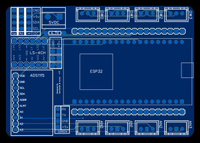

# FrangiPool PCB

Vous trouverez ici le code source du PCB de FrangiPool.
Il s'agit d'une carte alimentée en 5v qui va accueillir différents composants dont une carte ESP32 pour le calcul principal.
Tous les GPIO de l'ESP32 sont accessibles via des connecteurs dupont.
La carte possède en plus :

* un convertisseur analogique/I2C ADS1115 avec un convertisseur pour gérer 4 entrées analogiques en 5V
* Un bus 1Wire avec 4 connecteurs directs
* Un connecteur pour un écran Nextion
* Des connecteurs I2C
